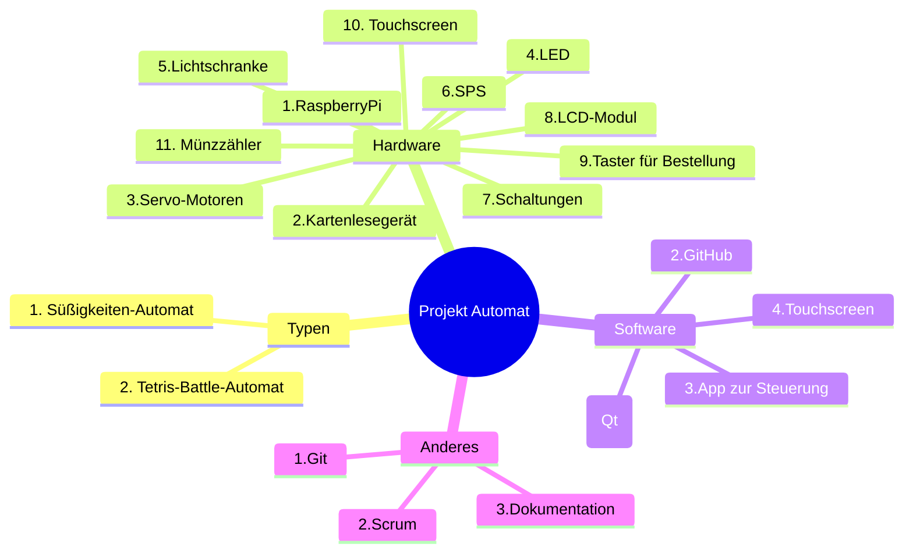

# Projekt_Automat
Repository Projekt ITEC

```mermaid
mindmap
  root((Projekt Automat))
    Typen
      1. Süßigkeiten-Automat
      2. Tetris-Battle-Automat
    Hardware
      1.RaspberryPi
      2.Kartenlesegerät
      3.Servo-Motoren
      4.LED
      5.Lichtschranke
      6.SPS
      7.Schaltungen
      8.LCD-Modul
      9.Taster für Bestellung
      10. Touchscreen
      11. Münzzähler
    Software
      1.Python/Java/C++(Qt)
      2.GitHub
      3.App zur Steuerung
      4.Touchscreen
    Anderes
      1.Git
      2.Scrum
      3.Dokumentation

```
   
