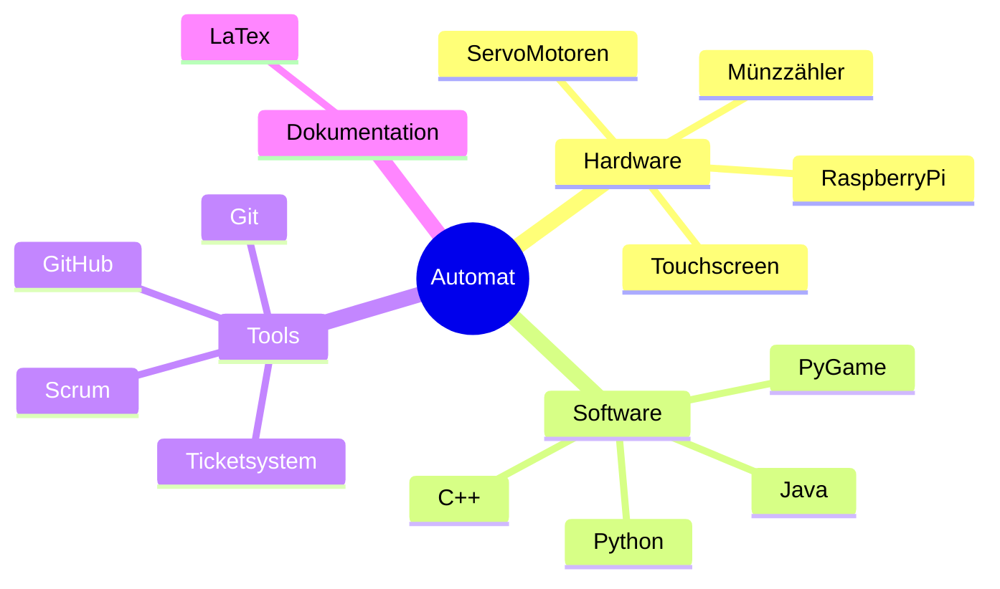

# Projekt_Automat
Repository Projekt ITEC

## Teams:
* GUI+ Hardwaresteuerung: Adrian, Ömer, Flo
* Spieleentwicklung: Colin, Attila, (Adrian)
* Caseenwicklung: Levin, Yousif
* Elektronik: Jamal, Valentin
* Dokumentation und Koordination: Niels, Flo 

   
