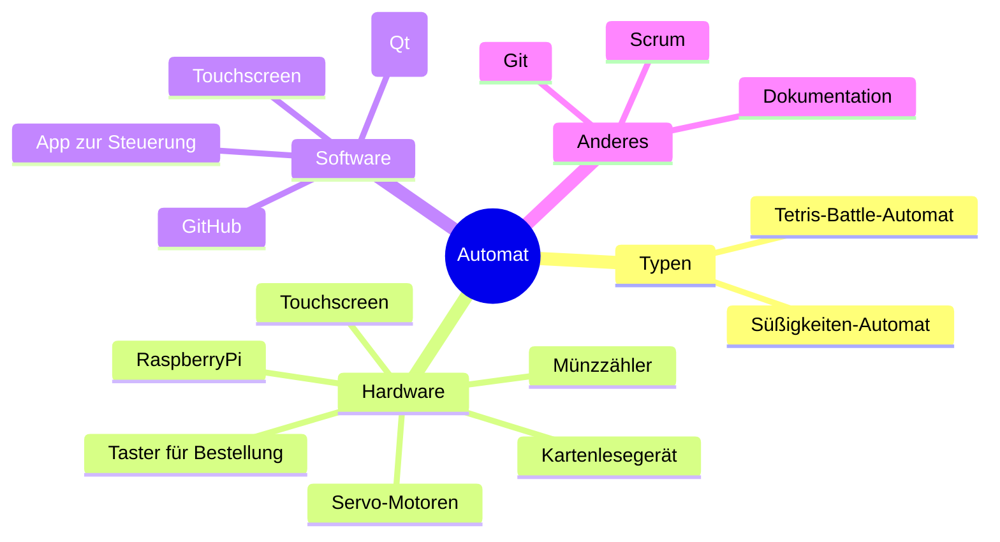

# Projekt_Automat
Repository Projekt ITEC

```mermaid
mindmap
  root((Automat))
    Typen
      Süßigkeiten-Automat
      Tetris-Battle-Automat
    Hardware
      RaspberryPi
      Kartenlesegerät
      Servo-Motoren
      Taster für Bestellung
      Touchscreen
      Münzzähler
    Software
      Python/Java/C++(Qt)
      GitHub
      App zur Steuerung
      Touchscreen
    Anderes
      Git
      Scrum
      Dokumentation

```
   
